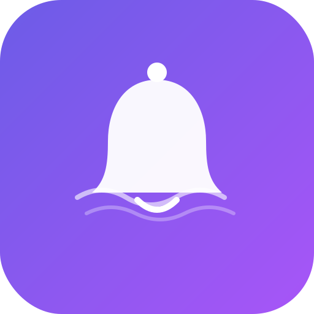

<p align="center">
  
</p>

<h1 align="center">RemindMe AI — Amma</h1>

<p align="center">
  <em>Your autonomous, voice-powered reminder assistant that actually listens.</em>
</p>

<p align="center">
  
  
  
  
  
</p>

<p align="center">
  <strong>Say "Amma" — and she's listening.</strong>
</p>

---

## ✨ The Vision

Most reminder apps make you *work*. You unlock your phone, open the app, tap through modals, type out your thought, pick a date, pick a time — and by then, you've already forgotten what you wanted to remember.

**RemindMe AI is different.** I built it to be the assistant I always wanted — one that you can just *talk to*. Say **"Amma"**, and she wakes up. Tell her *"remind me to prepare lunch at 10 AM every day"*, and she figures out the rest: title, time, recurrence, priority — everything. No tapping. No typing. No cognitive overhead.

But reminders are just the beginning. **Amma** is evolving into a deeply personal AI companion that understands your daily routine — your health, your habits, your schedule — and proactively helps you live better.

---

## 🧠 What Makes This Different

<table>
<tr>
<td width="50%">

### 🎙️ Voice-First, Always-On
No buttons to press. Amma continuously listens in the background for her wake word. When she hears **"Amma"**, **"Hey Amma"**, or **"Hi Amma"**, she enters conversation mode and keeps listening until you pause for 5 seconds.

She doesn't just *transcribe* — she **understands**.

</td>
<td width="50%">

### 🤖 Autonomous Actions
After you speak, Amma's AI engine analyzes your entire transcript and **autonomously decides** what to do:

- 📝 Create a note
- ⏰ Set a reminder
- ❓ Answer a question
- 🔍 Ask for clarification

No menus. No prompts. She just *acts*.

</td>
</tr>
<tr>
<td width="50%">

### 🧬 On-Device AI
On Android, Amma runs **Gemma 2B** directly on your phone via MediaPipe — no internet needed for AI. On the web, she seamlessly switches to the **Gemini 2.0 Flash API** (free tier). Same experience, different engine.

</td>
<td width="50%">

### ❤️ Health Intelligence
A full health tracking system powered by a custom **RAG (Retrieval-Augmented Generation)** engine. Amma knows about water intake, calories, sleep quality, sunlight exposure, and more — backed by NIH/CDC research and delivered through a personalized health knowledge base.

</td>
</tr>
</table>

---

## 🖥️ Features

### 📌 Smart Reminders
- **Natural language scheduling** — *"Remind me to call mom next Friday at 3 PM"*
- **Recurrence patterns** — daily, weekdays, weekends, weekly, monthly
- **Priority levels** — low, medium, high with visual indicators
- **Snooze & dismiss** — with configurable snooze durations
- **AI-generated messages** — personalized alarm messages that address you by name

### 📝 Rich Notes
- **Color-coded notes** — 7 beautiful color options
- **Reminder attachments** — attach a reminder to any note
- **Search** — instantly find notes and reminders
- **Voice-to-note** — dictate thoughts naturally

### 🎙️ Voice Engine
- **Wake word detection** — always-on *"Amma"* listener
- **Continuous conversation mode** — speak naturally, she listens until you pause
- **Advanced NLP parser** — extracts dates, times, recurrence, and priority from natural speech
- **Handles complex phrases** like:
  - *"In 2 hours remind me to take the cake out of the oven"*
  - *"Every weekday at 9 AM tell me to check my emails"*
  - *"I need to submit the report by Friday 5 PM"*

### 🔊 Audio & Speech
- **Text-to-Speech** — Amma reads reminders aloud when they fire
- **Multiple alarm sounds** — Gentle Chime, Urgent Bell, Musical Tone, Retro Beep
- **All sounds synthesized** — generated with Web Audio API, no audio files needed
- **Configurable voice** — choose from system voices, adjust speech rate

### ❤️ Health & Habits Dashboard
- **Personalized onboarding** — 10-step wizard collects your profile (age, weight, height, activity level, wake/sleep times)
- **Scientific calculations**:
  - 💧 **Water target** — based on body weight + activity level (IOM guidelines)
  - 🔥 **Daily calories** — Mifflin-St Jeor BMR × Harris-Benedict activity multiplier
  - 📊 **BMI** — calculated from your height and weight
  - ☀️ **Vitamin D assessment** — based on sunlight exposure vs NIH recommendations
  - 😴 **Sleep quality** — rated against CDC/NIH 7-9 hour guidelines
- **Quick logging** — one-tap water intake, meal descriptions with calorie estimation, sleep hours, sunlight minutes
- **7-day trend charts** — visual bar charts for water, calories, and sleep
- **Morning check-in** — proactive popup between 5-10 AM to log last night's sleep
- **AI health chat** — ask Amma health questions and she provides research-backed answers using RAG

### 🧠 Health RAG Engine
- **8 knowledge base documents** covering hydration, nutrition, sleep, sunlight, exercise, food intake, BMI, and time management
- **Keyword extraction with synonym expansion** — understands related terms
- **Relevance scoring with title boost** — retrieves the most relevant health knowledge
- **Personalized context injection** — combines your health profile data with retrieved knowledge
- **Evidence-based** — sourced from NIH, CDC, USDA FoodData Central, and peer-reviewed research

### 🤖 AI Engine
- **Dual-mode architecture**:
  - 📱 **Mobile**: On-device Gemma 2B via MediaPipe GenAI (no internet required)
  - 🌐 **Web**: Gemini 2.0 Flash API (free tier with API key)
- **Unified bridge** — same `generateResponse()` API regardless of platform
- **Token-efficient prompts** — kept under 2048 tokens for Gemma 2B's context window
- **Action-oriented AI** — doesn't just answer, it *does things*

---

## 🏗️ Architecture

```
RemindMe AI (Amma)
├── Frontend: Vanilla JS + HTML + CSS (Single Page App)
│   ├── main.js          — App controller, navigation, rendering, AI
│   ├── voice.js         — Speech recognition + NLP date/time parser
│   ├── wake-listener.js — Always-on wake word detection engine
│   ├── auto-action.js   — Autonomous action engine (AI → actions)
│   ├── llm-bridge.js    — Unified LLM interface (native/web)
│   ├── scheduler.js     — 1-second interval alarm checker
│   ├── audio.js         — Web Audio API sounds + TTS engine
│   ├── db.js            — IndexedDB persistence layer
│   ├── health.js        — Pure health calculation functions
│   ├── health-ui.js     — Health dashboard, onboarding, logging
│   ├── health-chat.js   — AI health tool call handler
│   ├── health-rag.js    — RAG engine for health knowledge
│   └── style.css        — Dark theme, glassmorphism, animations
│
├── Native Shell: Capacitor 7 (Android)
│   ├── LlmPlugin.java  — On-device Gemma 2B via MediaPipe
│   ├── HealthPlugin.java — Native health notifications
│   └── MainActivity.java — Bridge + plugin registration
│
├── Storage: IndexedDB
│   ├── reminders        — Active reminders with scheduling
│   ├── notes            — Color-coded user notes
│   ├── history          — Completed reminder archive
│   ├── settings         — Key-value app preferences
│   ├── health_metrics   — Timestamped health data points
│   └── user_health_profile — Personalized health targets
│
├── Health Knowledge Base: JSON documents (public/health-kb/)
│   ├── bmi_weight_height.json
│   ├── water_hydration.json
│   ├── calories_nutrition.json
│   ├── sleep_quality.json
│   ├── sunlight_vitamin_d.json
│   ├── exercise_activity.json
│   ├── time_management.json
│   └── food_intake.json
│
└── Build: Vite → dist/ → Capacitor sync → Gradle APK
```

### Design Philosophy

- **No frameworks** — Pure vanilla JS with ES modules. No React, no Vue, no Angular. Just clean, fast, dependency-light code.
- **Offline-first** — Everything works without internet. IndexedDB for storage, Web Audio API for sounds, on-device AI for intelligence.
- **Privacy-first** — Health data, reminders, and notes never leave your device. The on-device LLM processes everything locally.
- **Progressive enhancement** — Works as a PWA in any browser, but unlocks full power as a native Android app.

---

## 🎨 Design

The UI follows a **premium dark-mode aesthetic** with glassmorphism and micro-animations:

- **Color palette**: Deep dark (`#0a0a1a`) with vibrant purple accent (`#6C5CE7`)
- **Typography**: Inter font family (300–800 weights) from Google Fonts
- **Cards**: Glassmorphic design with `backdrop-filter: blur(10px)` and subtle borders
- **Animations**: Smooth slide-ins, pulse rings on alarms, voice wave visualizations
- **Responsive**: Fully responsive sidebar layout that collapses on mobile

---

## 🚀 Getting Started

### Prerequisites
- Node.js 18+
- Android Studio (for native builds)
- A Gemini API key from [Google AI Studio](https://aistudio.google.com/apikey) (free, for web mode)

### Development (Web)

```bash
# Clone the repository
git clone https://github.com/SaiSanjay21/Amma.git
cd Amma

# Install dependencies
npm install

# Start development server
npm run dev
```

Open [https://localhost:5173](https://localhost:5173) in Chrome (HTTPS required for voice recognition).

### Android Build

```bash
# Build web assets + sync to Android
npm run android:build

# Open in Android Studio
npm run android:open

# Or build and run directly
npm run android:run
```

### On-Device AI Setup (Android)

1. Download the **Gemma 2B** model from Kaggle (~1.3 GB, one-time)
2. The app can auto-detect and install the model from your Downloads folder
3. Once loaded, AI works completely offline

### Web AI Setup

1. Get a free API key from [Google AI Studio](https://aistudio.google.com/apikey)
2. Open **Settings → AI Engine** in the app
3. Paste your Gemini API key and click **Save Key**

---

## 🗂️ Project Structure

| File | Purpose | Lines |
|------|---------|-------|
| `index.html` | Single HTML page with all views (SPA via CSS toggling) | ~670 |
| `src/main.js` | App controller — init, navigation, rendering, settings, AI | ~1950 |
| `src/voice.js` | Speech recognition + NLP date/time parser | ~663 |
| `src/wake-listener.js` | Always-on wake word detection + conversation engine | ~447 |
| `src/auto-action.js` | Autonomous action engine (transcript → AI → actions) | ~344 |
| `src/llm-bridge.js` | Unified LLM bridge (native Gemma / web Gemini) | ~240 |
| `src/scheduler.js` | Alarm scheduler (1-second interval checker) | ~191 |
| `src/audio.js` | Web Audio API alarm sounds + TTS engine | ~318 |
| `src/db.js` | IndexedDB storage layer (CRUD, export/import, health) | ~217 |
| `src/health.js` | Pure health calculation functions (BMR, water, sleep, etc.) | ~279 |
| `src/health-ui.js` | Health dashboard UI, onboarding wizard, morning popup | ~756 |
| `src/health-chat.js` | AI health tool call handler | ~92 |
| `src/health-rag.js` | RAG engine for health knowledge retrieval | ~287 |
| `src/style.css` | Dark theme, glassmorphism, animations, responsive layout | ~1200+ |

---

## 🛠️ Tech Stack

| Layer | Technology |
|-------|-----------|
| **Frontend** | Vanilla JavaScript (ES Modules), HTML5, CSS3 |
| **Build** | Vite 7 |
| **Native Shell** | Capacitor 7 (Android) |
| **Storage** | IndexedDB |
| **AI (Mobile)** | MediaPipe GenAI — Gemma 2B (on-device, INT4 quantized) |
| **AI (Web)** | Google Gemini 2.0 Flash API |
| **Voice** | Web Speech API / Android Google Speech UI |
| **TTS** | Capacitor Text-to-Speech / Web Speech Synthesis |
| **Audio** | Web Audio API (synthesized alarm sounds) |
| **PWA** | Service Worker, Web App Manifest |
| **Health KB** | Custom JSON knowledge base with RAG retrieval |
| **Fonts** | Inter (Google Fonts) |

---

## 🔮 Roadmap

- [ ] 🍎 iOS support via Capacitor
- [ ] 📊 Advanced health analytics and weekly reports
- [ ] 🏋️ Exercise tracking and workout reminders
- [ ] 🍽️ Meal planning suggestions based on calorie targets
- [ ] 🧘 Meditation and mindfulness reminders
- [ ] 📍 Location-based reminders (*"Remind me when I get home"*)
- [ ] 🔗 Calendar integration (Google Calendar, Apple Calendar)
- [ ] 👨‍👩‍👧 Family health tracking (multi-user profiles)
- [ ] 🌍 Multi-language voice support
- [ ] 📱 Widgets for quick health logging

---

## 💡 Why "Amma"?

**Amma** (అమ్మ) means *"mother"* in Telugu. Just like a mother who always remembers what you need, always has your health in mind, and always listens — Amma is designed to be that caring, ever-present assistant in your pocket.

She doesn't just set timers. She *understands* you.

---

<p align="center">
  <strong>Built with ❤️ and lots of late nights</strong>
</p>

<p align="center">
  <sub>⚠️ Health features are for informational purposes only. Not a substitute for professional medical advice.</sub>
</p>
